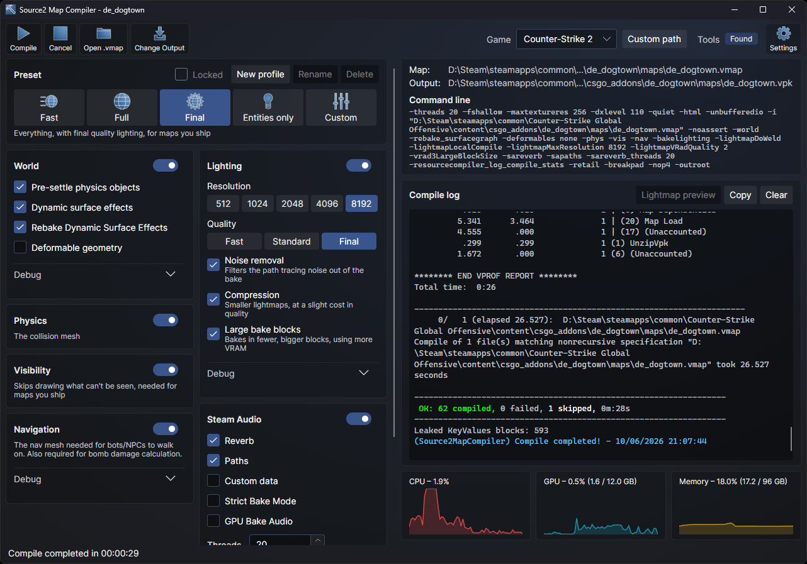

# Source2 Map Compiler
A GUI for resourcecompiler with the same options as Hammer for compiling maps, plus more.

## Improvements

- Compiles outside of Tools, the Source2 tools eat up a ton of system resources and RAM, on some systems this can make a huge impact to compile speed.
- Added a live Lightmap Preview, showing each block of the lightmap and each light probe volume as vrad3 finishes baking them on the GPU.
- Improved preset options, for example "Final" now compiles an 8k lightmap.
- Added a progress bar that follows the compile's stages, with counts like the lightmap blocks baked and the vis passes done.
- Added CPU, GPU, video memory and memory graphs, to see how many system resources the compile is using.
- Exposes extra resourcecompiler options, like thread counts for the compiler and Steam Audio, lightmap compression and bake block size, deterministic lightmap charts, and debug output.
- Added profiles, your own named presets, which can be locked so changing an option doesn't overwrite them.
- Compile settings are saved per map in a `<map>_compilepreset.vdf` next to the `.vmap`, so they travel with the map, for example in source control.
- Remembers the game picked last, and for each game its last map, profiles and options.
- Compiles several maps in one go from a `.txt` map list.

# Requirements
- Any Source 2 game and Workshop Tools installed. (If the application cannot find the game, click Custom Path and select the game's exe.)

# Usage

1. Open your .vmap file (or a .txt map list).
2. Select the desired options, or start from one of the presets.
3. Click Compile. Everything resourcecompiler prints shows up in the compile log.
